## 什么是二三查找树？B树 B+树 B*树？ 

### 为什么我们需要B树

**目前学习了这么多数据结构，我们可以了解到的搜索结构如下表所示：**

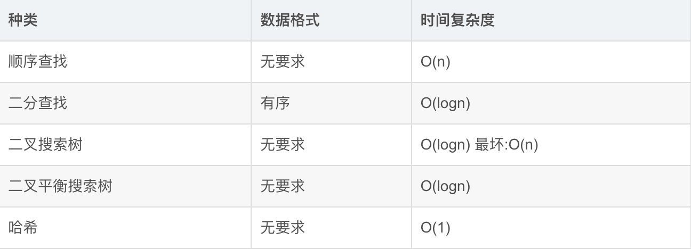

以上结构适合用于数据量相对不是很大，能够一次性存放在内存中，进行数据查找的场景。如果
数据量很大，比如有100G数据，无法一次放进内存中，那就只能放在磁盘上了，如果放在磁盘
上，有需要搜索某些数据，那么如果处理呢？那么我们可以考虑将存放关键字及其映射的数据的
地址放到一个内存中的搜索树的节点中，那么要访问数据时，先取这个地址去磁盘访问数据。
例子：

假设我们用一棵二叉平衡搜索树存储10亿个数据。由于数据太多太大（key太大），我们内存中是存不下的，因此我们节点里面存的是数据在磁盘中的地址。由于我们在查找一个数的时候，是需要对比的，但是我们的key值其实没有存储在内存中，因为我们需要进行一次IO，到磁盘中，我们才能完成对比。10亿个数据，即30层左右的平衡树。

如果我们查找一个数字，需要30次IO，这个时间消耗是巨大的！现在我们认为，同样是10亿个数据，我只想进行2~3次IO，怎么办？我们需要压缩高度！

**如何压缩搜索树的高度？**

- 二叉变多叉
- 一个节点存多个key的地址

### B树概念

一棵m阶(m>2)的B树，是一棵平衡的M路平衡搜索树，可以是空树或者满足一下性质：

- 根节点至少有两个孩子
- 每个分支节点都包含k-1个关键字和k个孩子，其中 ceil(m/2) ≤ k ≤ m （ceil是向上取整函数）
- 每个叶子节点都包含k-1个关键字，其中 ceil(m/2) ≤ k ≤ m
- 所有的叶子节点都在同一层
- 每个节点中的关键字从小到大排列，节点当中k-1个元素正好是k个孩子包含的元素的值域划分
- 每个结点的结构为：（n，A0，K1，A1，K2，A2，… ，Kn，An）其中，Ki(1≤i≤n)为关键字，且Ki<Ki+1(1≤i≤n-1)。Ai(0≤i≤n)为指向子树根结点的指针。且Ai所指子树所有结点中的关键字均小于Ki+1。n为结点中关键字的个数，满足ceil(m/2)-1≤n≤m-1。

其实我们熟知的二三查找树，就是一棵三阶的B树。虽然我们今天重点要学习的是B树，但是其实在日常使用中，B+树才是最常用的。

### B树的插入

B树的插入的核心，就是节点的分裂。

**注意：插入节点一定是在叶子上插入！为什么？请看下面详细插入过程。**

下面我们用序列[53,139,75,49,145,36,50,47,101]来给大家进行解释。**（设B树阶数 M == 3）**

- **插入节点53**

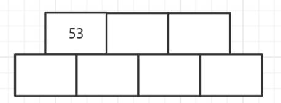

**由于在一个节点中，孩子比关键字的数量多一个，**所以上述结构我们就可以很好的理解了。

**此时，M==3，而我们却画了4个孩子的空间**，这是为什么？这其实是为了简化我们在实现B树分裂过程的代码，等我继续解释完，大家就明白了！

- **插入节点139**

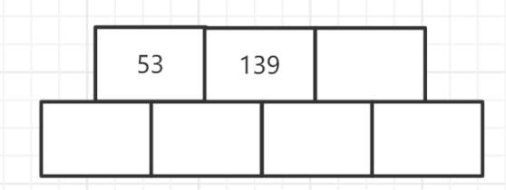

 由于性质5，所以我们在每一个节点中，key值都是递增的，所以139插入到53的后面。此时我们还是满足B树的性质的，一个节点并没有满。因此当前阶段，我们不需要分裂。

- **插入节点75**

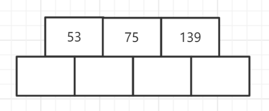

 插入75之后，我们发现，key的数量已经超过了规定的最大数量（3-1=2个），**因此，此时我们要进行分裂。**

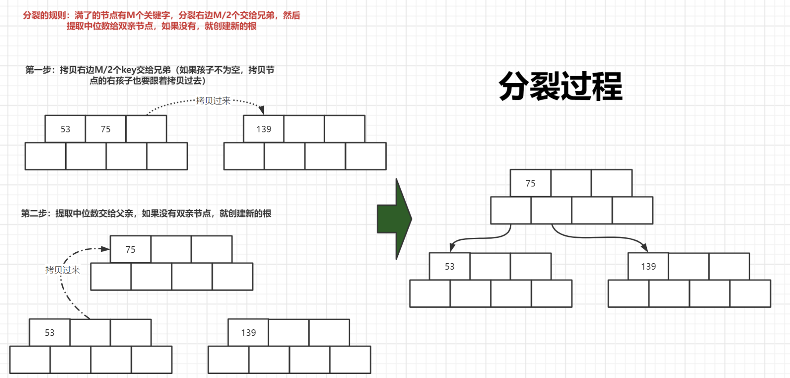

**此时我们已经可以发现，为什么我们要多开一个key和孩子的节点位置。因为这样，我们可以先把节点插入进来，再判断节点是否满，是否需要分裂。如果不开多一个位置，我们都不知道怎么去分裂了，因为一插入就越界了。** 

- **插入节点49**

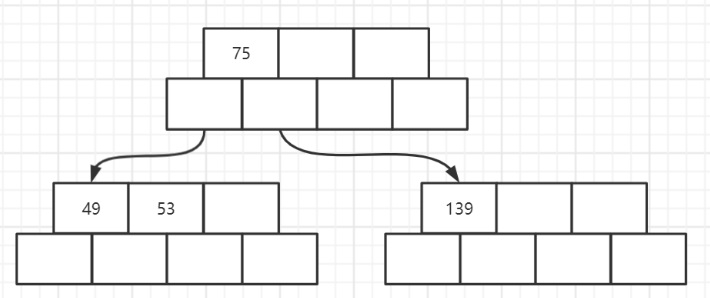

- **插入节点145** 

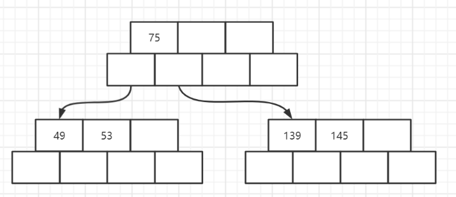

-  **插入节点36**

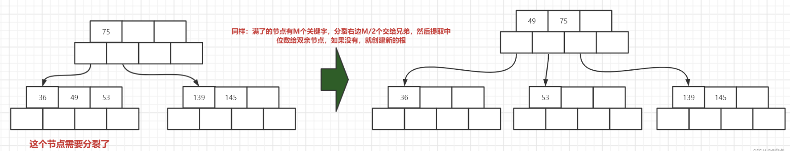

 **插入36之后，我们发现我们需要分裂了，因此像刚刚一样，完成一次分裂即可。**

- **插入节点101**

**此时是一个连续分裂的过程**

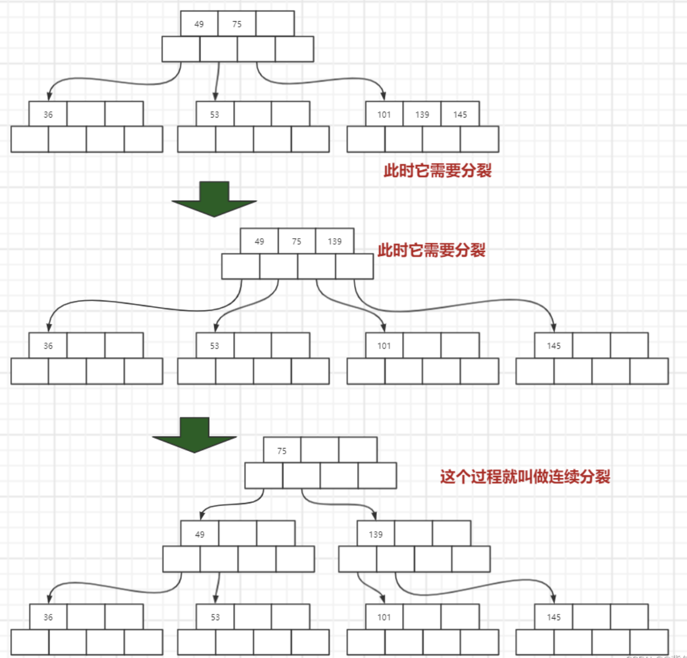

**看到这里，相信大家已经对B树是如何完成插入，有了一定的了解了，接下来我们来做一个做一个总结。**

插入过程总结：

- 如果树为空，直接插入新节点中，该节点为树的根节点
- 树非空，找待插入元素在树中的插入位置(注意：找到的插入节点位置一定在叶子节点中)
- 检测是否找到插入位置(假设树中的key唯一，即该元素已经存在时则不插入)
- 按照插入排序的思想将该元素插入到找到的节点中
- 检测该节点是否满足B-树的性质：即该节点中的元素个数是否等于M，如果小于则满足
- 如果插入后节点不满足B树的性质，需要对该节点进行分裂：申请新节点，找到该节点的中间位置，将该节点中间位置右侧的元素以及其孩子搬移到新节点中，将中间位置元素以及新节点往该节点的双亲节点中插入，即循环继续
- 如果向上已经分裂到根节点的位置，插入结束

### BTree.h实现代码

Btree代码已经上传github，欢迎前往查阅各期周报代码。

算法周报代码仓库：https://github.com/sysuacmm/AlgorithmnWeekly

### B+树

B+树是B树的变形，是在B树基础上优化的多路平衡搜索树，B+树的规则跟B树基本类似，但是又
在B树的基础上做了以下几点改进优化：

- 分支节点的子树指针与关键字个数相同
- 分支节点的子树指针p[i]指向关键字值大小在[k[i]，k[i+1])区间之间
- 所有叶子节点增加一个链接指针链接在一起
- 所有关键字及其映射数据都在叶子节点出现

**这个就是一棵B+树 ，它的一个节点中的key数量和孩子数量是一样的。**

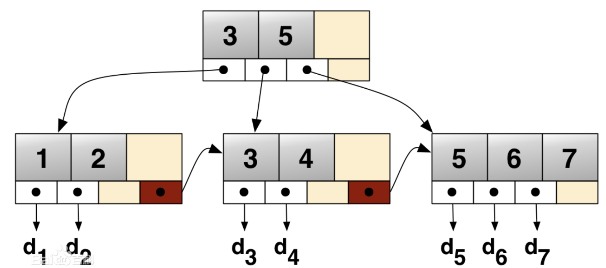

### B+树的插入

**同样，博主也通过画图的方式带着大家理解B+树，这样更便于我们的理解。**

我们通过序列[53,49,75,139,49,145,36,150,155]来理解3阶B+树的插入

同样，三阶B+树，每层节点我们开4个空间

- **插入53，49，75**

- **插入139**

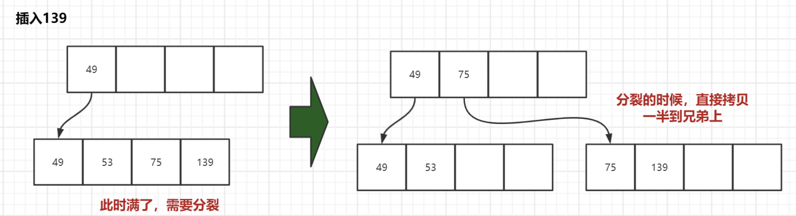

- **插入36**

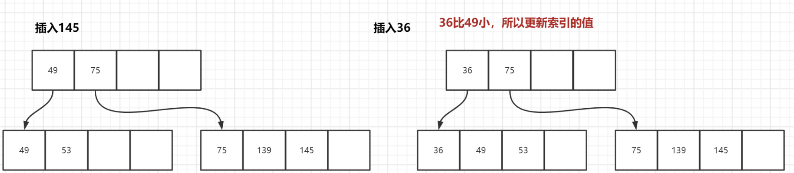

-  **插入101**

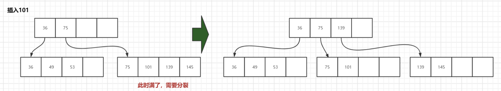

- **插入150，155** 

**此时就需要一个连续的分裂过程了**

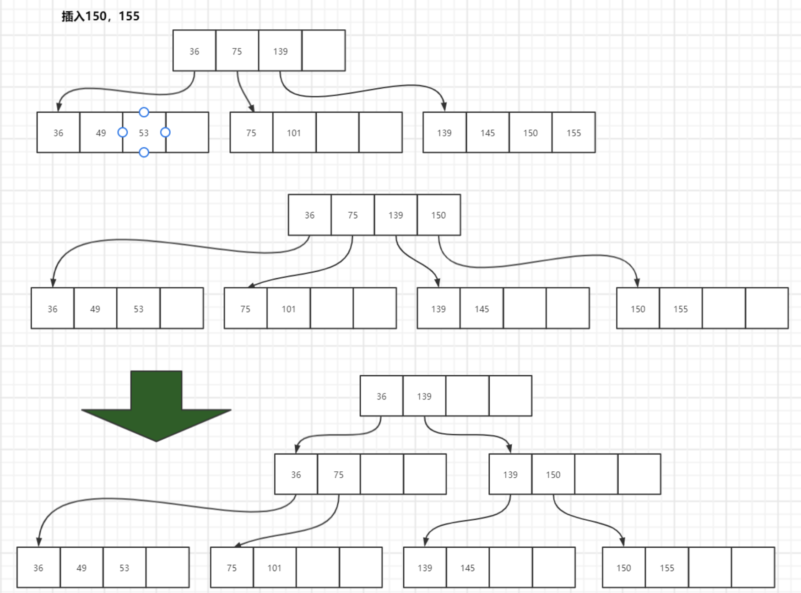

### B+树的性质

1. 所有关键字都出现在叶子节点的链表中，且链表中的节点都是有序的。
2. 不可能在分支节点中命中。
3. 分支节点相当于是叶子节点的索引，叶子节点才是存储数据的数据层。

### B* 树
B* 树是B+树的变形，在B+树的非根和非叶子节点再增加指向兄弟节点的指针。
**B+树的分裂：**
当一个结点满时，分配一个新的结点，并将原结点中1/2的数据复制到新结点，最后在父结点中增
加新结点的指针；B+树的分裂只影响原结点和父结点，而不会影响兄弟结点，所以它不需要指向
兄弟的指针。
**B* 树的分裂：**
当一个结点满时，如果它的下一个兄弟结点未满，那么将一部分数据移到兄弟结点中，再在原结
点插入关键字，最后修改父结点中兄弟结点的关键字（因为兄弟结点的关键字范围改变了）；如
果兄弟也满了，则在原结点与兄弟结点之间增加新结点，并各复制1/3的数据到新结点，最后在父
结点增加新结点的指针。
所以，B*树分配新结点的概率比B+树要低，空间使用率更高；

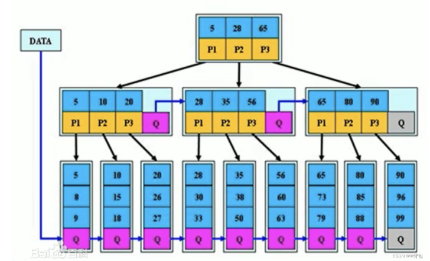

### B树系列结构总结
通过以上介绍，大致将B树，B+树，B* 树总结如下：
B树：有序数组+平衡多叉树；
B+树：有序数组链表+平衡多叉树；
B* 树：一棵更丰满的，空间利用率更高的B+树。

#### B树系列性能总结

在内存中做内查找:
B树系列和哈希和平衡搜索树对比:
单纯论树的高度，搜索效率而言，B树确实不错但是B树系列有一些隐形坏处:

空间利用率低，消耗高
插入删除数据时，分裂和合并节点，那么必然挪动数据3.虽然高度耕地，但是在内存中而言，和哈希和平衡搜索树还是一个量级的结论:实质上B树系列在内存中体现不出优势!
**因此，B树的优势主要体现在，外查找中！**

#### B树系列的应用
B-树最常见的应用就是用来做索引。索引通俗的说就是为了方便用户快速找到所寻之物，比如：
书籍目录可以让读者快速找到相关信息，hao123网页导航网站，为了让用户能够快速的找到有价
值的分类网站，本质上就是互联网页面中的索引结构。
MySQL官方对索引的定义为：索引(index)是帮助MySQL高效获取数据的数据结构，简单来说：
索引就是数据结构。
当数据量很大时，为了能够方便管理数据，提高数据查询的效率，一般都会选择将数据保存到数
据库，因此数据库不仅仅是帮助用户管理数据，而且数据库系统还维护着满足特定查找算法的数
据结构，这些数据结构以某种方式引用数据，这样就可以在这些数据结构上实现高级查找算法，
该数据结构就是索引。