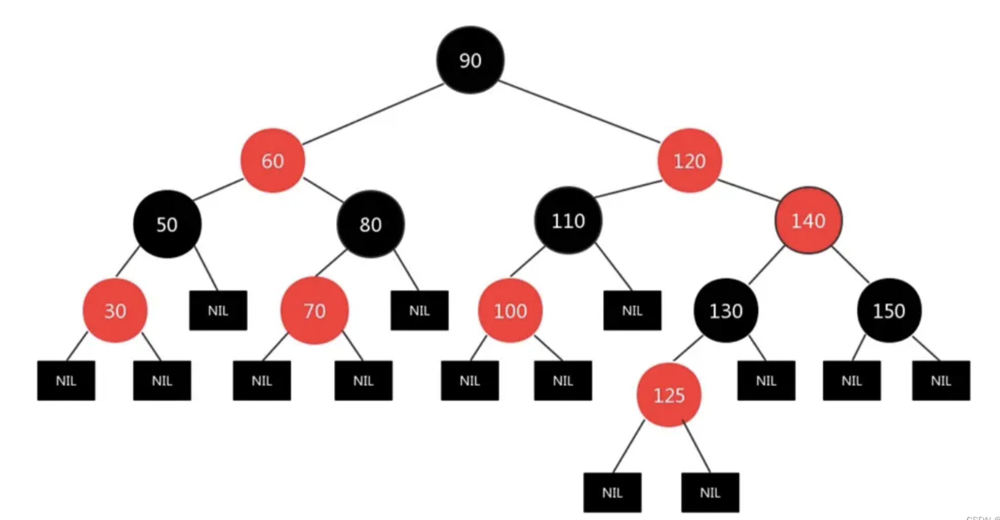
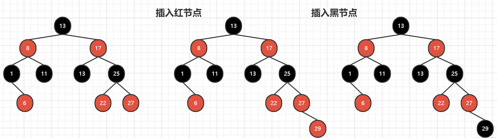
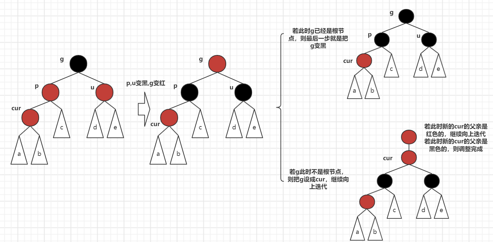
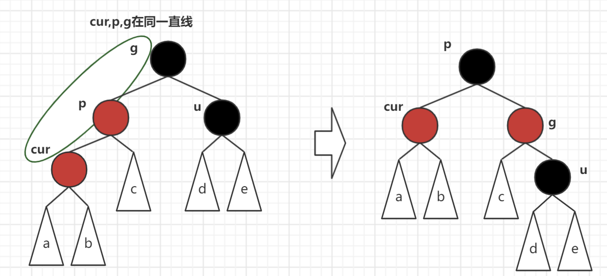
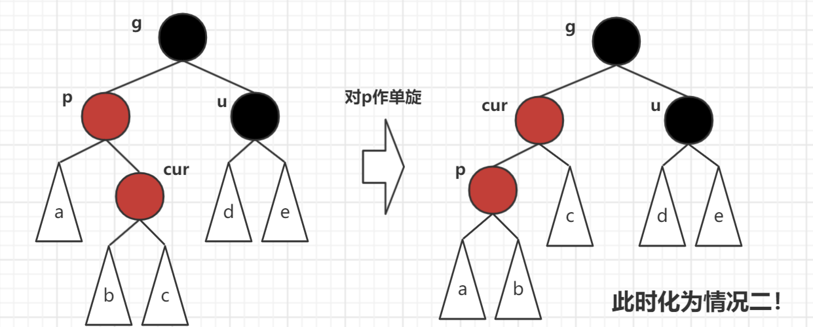

## 手撕红黑树插入算法

### 什么是红黑树

在学习红黑树之前，我们必须先了解和熟悉AVL树的插入算法，即AVL树维护搜索二叉树平衡的原理。其中包括：AVL树维护平衡的思想和4种旋转方式。

红黑树，是一种二叉搜索树，但在每个结点上增加一个存储位表示结点的颜色，可以是Red或Black。 **通过对任何一条从根到叶子的路径上各个结点着色方式的限制**，红黑树确保没有一条路径会比其他路径长出2倍，因而是接近平衡的。



因此，红黑树不是直接通过检验“没有一条路径会比其他路径长出2倍”而维护平衡的，而是通过对根到叶子路径上节点的着色的限制！它不是像AVL一样直接控制平衡，而是**间接**控制平衡。

#### 红黑树的性质

- 每个结点不是红色就是黑色
- 根节点是黑色的
- 如果一个节点是红色的，则它的两个孩子结点是黑色的
- 对于每个结点，从该结点到其所有后代叶结点的简单路径上，均 包含相同数目的黑色结点
- 每个叶子结点都是黑色的（此处的叶子结点指的是空结点（NIL节点））

### 红黑树节点的构造

这里我们采用三叉链的方式。

```cpp
enum Colour
{
    RED,
    BLACK
};
template <class K, class V>
struct __Red_Black_TreeNode
{
    __Red_Black_TreeNode<K, V> *_left;
    __Red_Black_TreeNode<K, V> *_right;
    __Red_Black_TreeNode<K, V> *_parent;
    std::pair<K, V> _kv;
    Colour _col;
    __Red_Black_TreeNode(const std::pair<K, V> &kv)
        : _left(nullptr), _right(nullptr), _parent(nullptr), _kv(kv) {}
};
```

### 红黑树节点的插入

首先我们要按照搜索树节点插入的规则，先插入节点，代码如下：

（代码中为什么一开始红黑树新插入的节点默认设置为红色，将在后面解释）

```cpp
bool insert(const std::pair<K, V> &kv)
{
    if (_root == nullptr)
    {
        _root = new Node(kv);
        _root->_col = BLACK;
        return true;
    }
    Node *parent = nullptr;
    Node *cur = _root;
    while (cur)
    {
        if (cur->_kv.first < kv.first)
        {
            parent = cur;
            cur = cur->_right;
        }
        else if (cur->_kv.first > kv.first)
        {
            parent = cur;
            cur = cur->_left;
        }
        else
            return false;
    }
    cur = new Node(kv);
    cur->_col = RED; // 一开始尽量先变红
    if (parent->_kv.first < kv.first)
    {
        parent->_right = cur;
    }
    else
    {
        parent->_left = cur;
    }
    cur->_parent = parent;
  	// ... 接下来的部分是维护红黑树性质的代码
  	// 旋转+变色
}
```

**在插入这部分，我们要牢牢记住红黑树的两个规则，这是我们插入节点最根本的根据！**

- 规则三:如果一个节点是红色的，那它的孩子是黑色的
- 规则四:对于每一个节点，从该节点到其所有后代叶子节点的简单路径上，均包含相同数目的黑色节点

#### 为什么新插入的节点默认设置成红色

**我们可以分为两种情况：**

- 插入节点的父亲是黑色的
- 插入节点的父亲是红色的 

如果插入节点的父亲是黑色的，我们插入黑色节点就会违反规则4，插入红节点并不违反规则，所以我们应该插入的节点应该设置成红色。

如果插入节点的父亲是红色的，我们插入黑色节点就会违反规则4，插入红节点违反规则3。

此时我们应该插入什么颜色的节点呢？

**答案是我们应该插入红色节点，再做后续的变色工作。**

原因：如果插入黑色节点，我们违反规则4，相当于整棵树违法了规则。而我们违反规则3，我们可以通过局部的调整颜色或者旋转解决问题，因此我们选择先把新节点设置成红色，再做变色（+旋转）的处理。

**因此，在红黑树中插入一个新节点，无论什么情况，先设置成红色！**



#### 变色和旋转

当我们插入一个红节点之后，我们就要检查这颗红黑树是否符合规则了。

如果插入节点的父亲是黑色，是不违反红黑树规则的，我们不需要做处理。

**下面我们重点讨论：插入节点的父亲为红色的情况。**

红黑树处理情况分类所要关注的节点：父亲、祖父和叔叔（叔叔为父亲的兄弟节点）

我们把握好父亲、祖父和叔叔，就能处理红黑树的所有状况。**其中，叔叔的颜色最为关键！**

下面是红黑树调整的三种情况：

约定cur为当前节点，p为父亲节点，g为祖父节点，u为叔叔节点。

**情况一：cur为红，p为红，g为黑，u存在且为红**



**tips：**我们可以发现，这个情况是不需要看左右的，cur在p的左或右，处理的方式其实都是一样的。

**情况二：cur为红，p为红，g为黑，u不存在或u为黑（且cur,p,g在同一直线上）**

在情况一中，我们把父亲变黑的时候，可以把叔叔一起拉下水，让叔叔也变黑，这样我们就能保证路径上的黑色节点个数保持一致。

**但是现在，叔叔不存在或叔叔已经是黑色的了，此时只能旋转了。**



**说明: u的情况有两种**

- 如果u节点不存在，则cur一定是新插入节点，因为如果cur不是新插入节点则cur和p一定有一个节点的颜色是黑色，就不满足性质4: 每条路径黑色节点个数相同
- 如果u节点存在，则其一定是黑色的，那么cur节点原来的颜色一定是黑色的现在看到其是红色的原因是因为cur的子树在调整的过程中将cur节点的颜色由黑色改成红色。

p为g的左孩子，cur为p的左孩子，则进行右单旋转;

相反，p为g的右孩子，cur为p的右孩子，则进行左单旋转

**p、g变色--p变黑，g变红** 

**因为cur,p,g在同一直线上，所以情况二只需要单旋！下面这种情况就需要双旋了！**

**情况三: cur为红，p为红，g为黑，u不存在/u为黑（且cur,p,g不在同一直线上）**

p为g的左孩子，cur为p的右孩子，则针对p做左单旋转；相反，p为g的右孩子，cur为p的左孩子，则针对p做右单旋转，此时则转换成了情况二。

**插入部分代码：**

```cpp
        // ... 节点的插入部分代码
				// 上面是搜索树插入代码
				// 以下是旋转+变色
				while (parent && parent->_col == RED)
        {
            Node *grandparent = parent->_parent;
            assert(grandparent && grandparent->_col == BLACK);
            // 关键看叔叔
            // 判断一下左右
            if (parent == grandparent->_left)
            {
                Node *uncle = grandparent->_right;
                // 情况1（不看方向）
                if (uncle && uncle->_col == RED)
                {
                    parent->_col = uncle->_col = BLACK;
                    grandparent->_col = RED;
                    // 继续向上处理
                    cur = grandparent;
                    parent = cur->_parent;
                }
                // 情况2+3
                // uncle不存在/存在且为黑
                else
                {
                    // 情况2
                    //    g
                    //   p  u
                    //  c
                    // 右单旋+变色
                    if (cur == parent->_left)
                    {
                        __rotate_right(grandparent); // 右单旋
                        parent->_col = BLACK;    // 父亲变黑
                        grandparent->_col = RED; // 祖父变红
                    }
                    // 情况3
                    //    g
                    //   p  u
                    //    c
                    // 左右双旋+变色
                    else
                    {
                        __rotate_left(parent); // 左单旋
                        __rotate_right(grandparent); // 右单旋
                        // 看着图写就行了
                        cur->_col = BLACK;
                        grandparent->_col = RED;
                    }
                    break;
                }
            }
            else
            {
                Node *uncle = grandparent->_left;
                // 情况1（不看方向）
                if (uncle && uncle->_col == RED)
                {
                    parent->_col = uncle->_col = BLACK;
                    grandparent->_col = RED;
                    // 继续向上处理
                    cur = grandparent;
                    parent = cur->_parent;
                }
                else
                {
                    // 情况2
                    //    g
                    //   u  p
                    //       c
                    // 左单旋+变色
                    if (cur == parent->_right)
                    {
                        __rotate_left(grandparent); // 左单旋
                        parent->_col = BLACK;    // 父亲变黑
                        grandparent->_col = RED; // 祖父变红
                    }
                    // 情况3
                    //    g
                    //   u  p
                    //     c
                    // 右左双旋+变色
                    else
                    {
                        __rotate_right(parent); // 右单旋
                        __rotate_left(grandparent); // 左单旋
                        // 看着图写就行了
                        cur->_col = BLACK;
                        grandparent->_col = RED;
                    }
                    break;
                }
            }
        }
        _root->_col = BLACK; // 最后无论根是红是黑 -- 都处理成黑
        return true;
    }
```

**tips：整体代码可见社团的GitHub**

### 检查红黑树是否合法

**思路：找到最左向下路径的黑色节点数作为基准值，检查每条路径黑色节点数目是否与基准值相等。**

```cpp
bool __prev_check(Node *root, int blackNum, int bench_mark)
{
    if (root == nullptr)
    {
        if (blackNum != bench_mark)
            return false;
        return true;
    }
    if (root->_col == BLACK)
    {
        blackNum++;
    }
    if (root->_col == RED && root->_parent->_col == RED)
    {
        // 存在连续的红节点，return false
        return false;
    }
    return __prev_check(root->_left, blackNum, bench_mark) &&
           __prev_check(root->_right, blackNum, bench_mark);
}
```

与此同时，我们还可以写一个中序，看看遍历结果是否是升序的。

### For Debug

```cpp
void test1()
{
    int a[] = {16, 3, 7, 11, 9, 26, 18, 14, 15};
    RBTree<int, int> t1;
    for (auto e : a)
    {
        t1.insert(std::make_pair(e, e));
    }
    t1.inorder(); // 可以写一个中序遍历，看是否有序
    std::cout << "is_balance():" << t1.is_balance() << std::endl;
}
void test2()
{
    size_t N = 10000;
    srand((unsigned)time(nullptr));
    RBTree<int, int> t1;
    for (size_t i = 0; i < N; ++i)
    {
        int x = rand();
        t1.insert(std::make_pair(x, i));
    }
    std::cout << "is_balance():" << t1.is_balance() << std::endl;
}
```

### Reference

[1]. 百度百科 https://baike.baidu.com/item/%E7%BA%A2%E9%BB%91%E6%A0%91/2413209?fr=aladdin

[2]. https://gitee.com/bithange/class_code/tree/master/class_105

